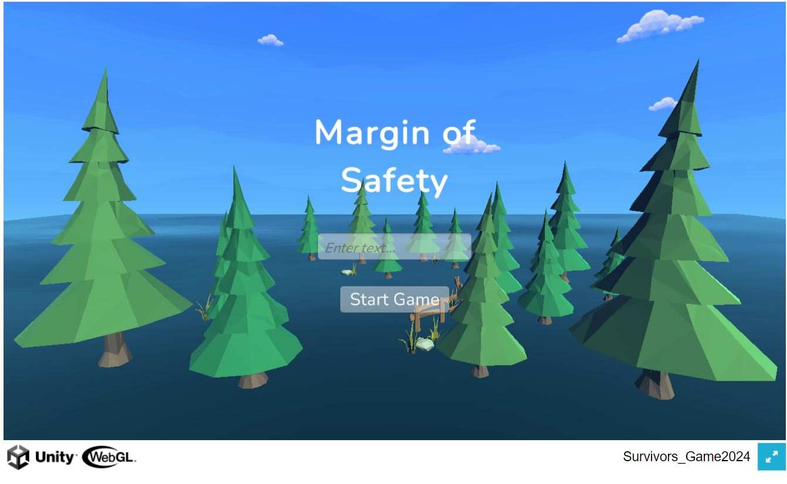
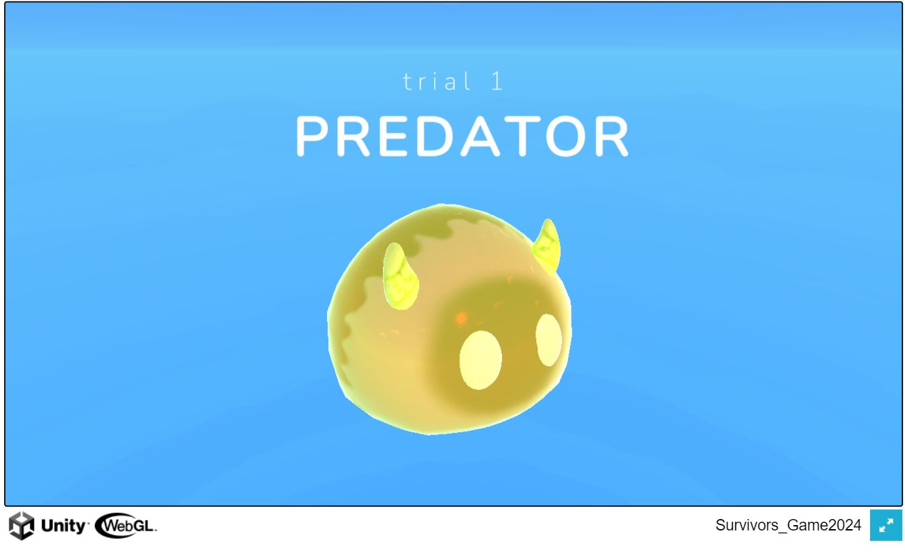
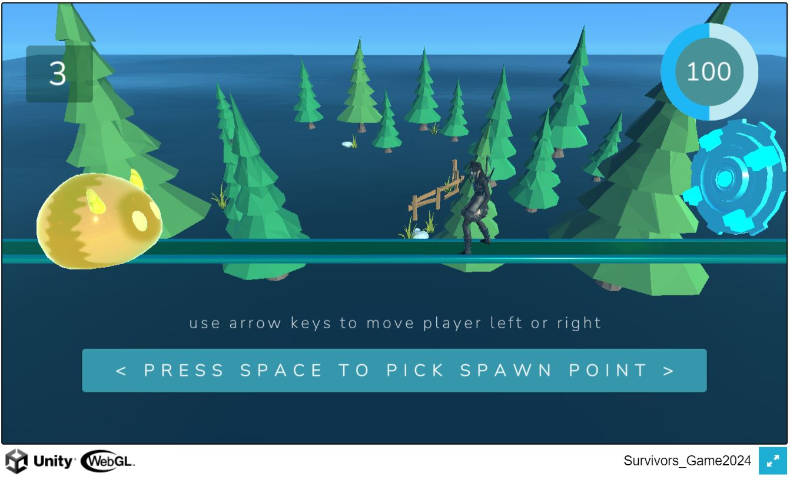
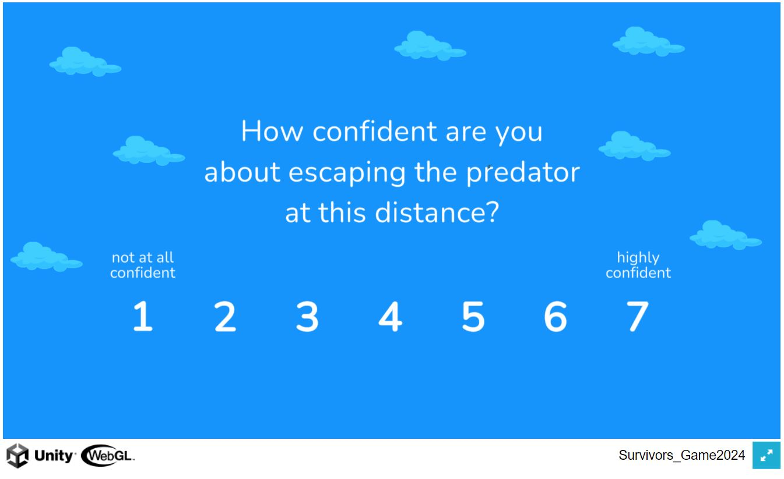
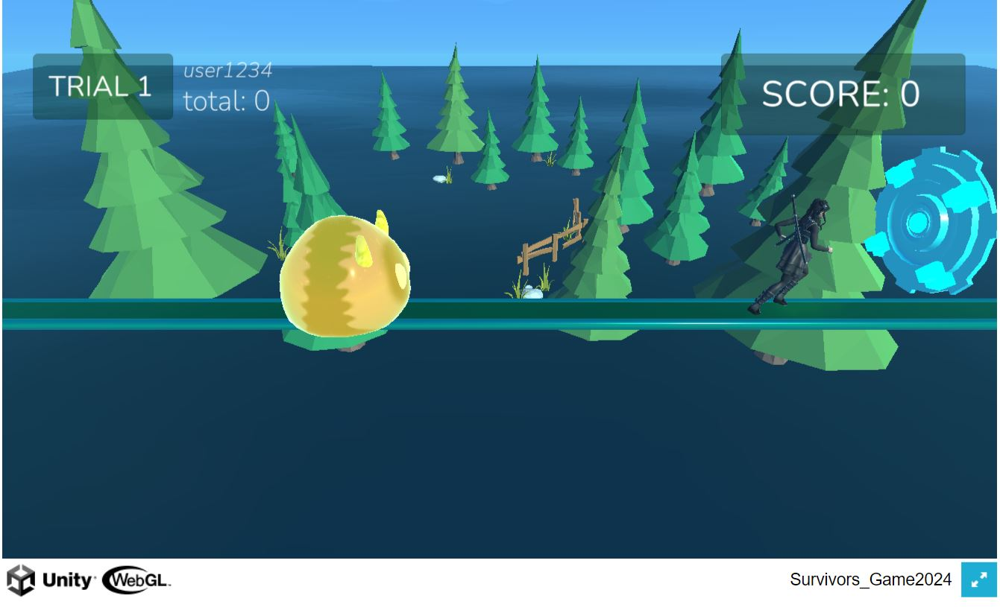
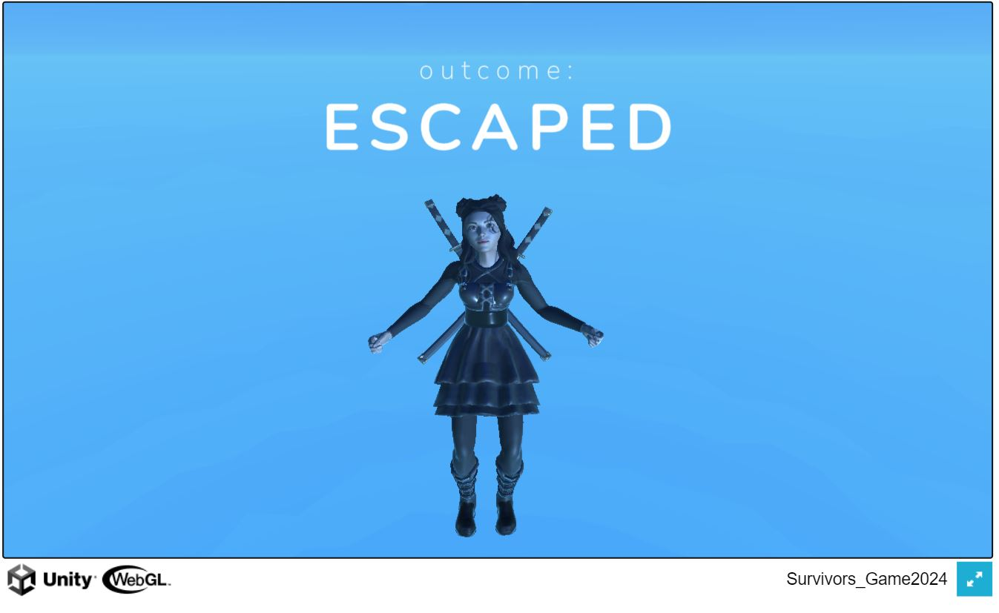
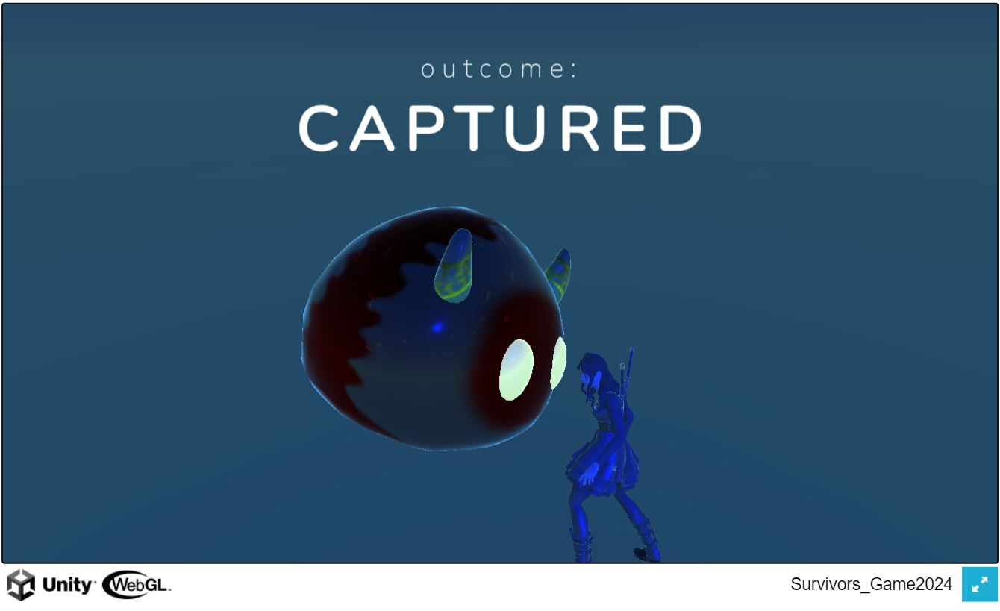
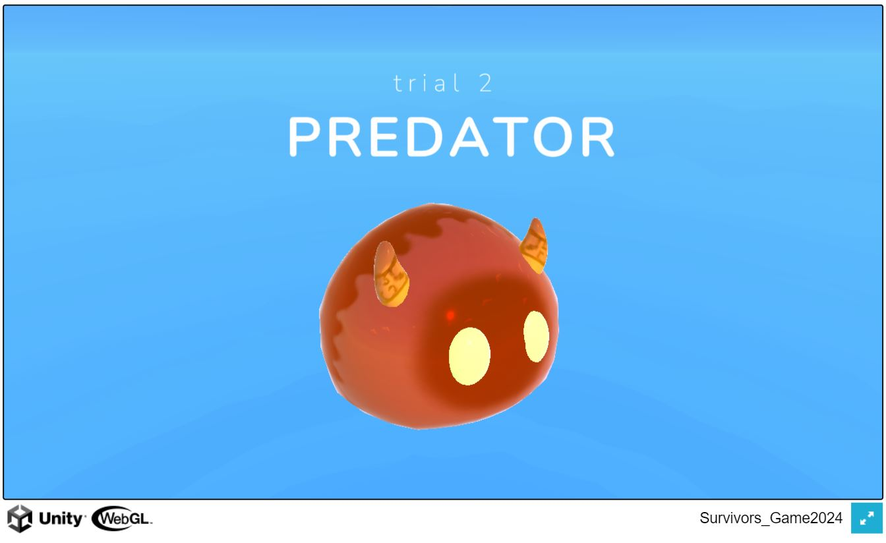

# mos-webgl-build
*WebGL Build for Margin of Safety Game*

# Game Objective

The Margin of Safety (MOS) game is very similar to the Flight Initiation Distance (FID) game. The only main changes are in player behavior.

The objective of the game is for the player to escape a predator by picking the optimal spawn point. Unlike FID, the player is allowed to move left and right to pick their spawn point, either moving closer to the predator or closer to the escape, and is given a few seconds to choose where to spawn. A score gauge in the right hand corner will signal the score a player will receive with that spawn location if they escape.

After the player has picked their spawn point, the trial begins. The player begins moving towards the escape and the predator begins moving towards the player once the trial starts. The predator will begin attacking at some unknown time just like in the FID game.

If the player manages to reach the escape before the predator catches them, points are awarded based on the spawn point picked by the user. A spawn point closer to the predator leads to more points, and closer to the escape leads to fewer points. The premise of the game is based on the player finding the optimal spawn point that will maximize their score without being caught by the predator. Points increase linearly with the distance the player moves, and points from completed trials are added up to calculate the player's total score.

The predator begins chasing the player at the beginning of the trial, and will begin "attacking" after some unknown amount of time. There are three types of predators of increasing difficulty that are color-coded to indicate which type they are.

# How To Play
*Game Link: https://fearlab2022.github.io/mos-webgl-build/*

The first screen the user is presented with is the login screen:

You can click the two diagonal arrows in the bottom right hand corner to enter fullscreen, and the ESC key to exit fullscreen. Enter your player PID or username into the text entry box and then click "Start Game" to proceed.

The next screen shows the trial number and the predator type:

Light yellow is the easiest difficulty, orange is harder, and dark red is the hardest difficulty level. After this screen, the game environment is shown and the player, predator, and escape zone are spawned in.

First, you need to pick your spawn point:

Use the left and right arrow keys or A (left) and D (right) keys to move the avatar to the desired spawn point. You have four seconds to pick a spawn point. Press SPACE to lock in a chosen spawn point. The score gauge on the top right of the screen will show the number of points awarded if the player escapes, and zero points will be awarded if the player is caught. Moving the spawn point closer to the predator results in more points, and closer to the escape results in fewer points.

Once the spawn point has been chosen, you will be asked to rate your confidence in escaping the predator:

After selecting a number between 1-7, the trial begins!

The predator and player will both begin moving towards the escape at a constant speed. At an unknown time point, the preddator will begin attacking and speed up. After either the player is caught or manages to escape, the trial ends.

The next screen shows the trial outcome:

The next screen then begins with the next trial, first showing the trial number for the next trial and the predator type:

And the same gameplay process repeats again. The score awarded in the previous trial has been added to the total score and is visible on the top left. This demonstration includes 10 trials total.
